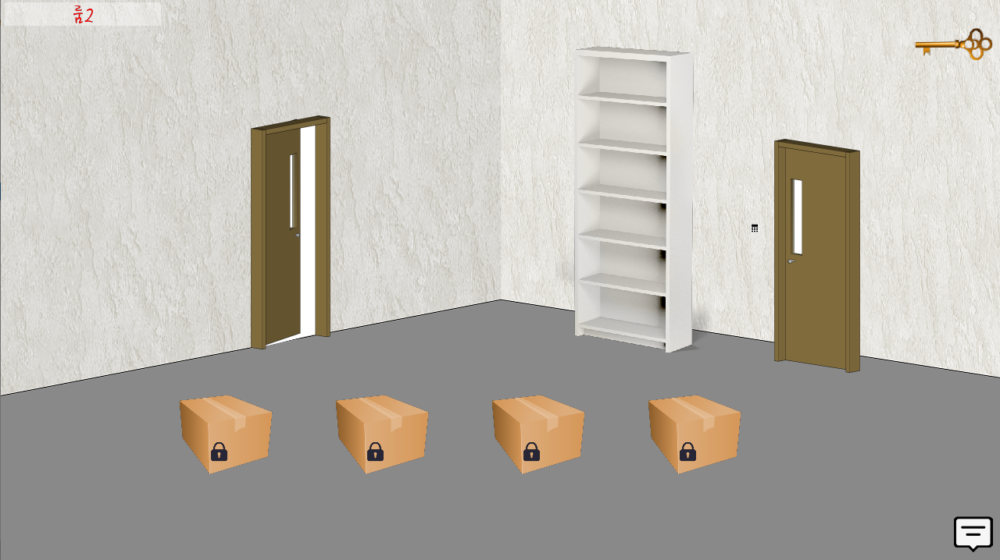

# puang-bangtal
이 게임은 중앙대학교 객체지향프로그래밍 수업의 일환으로 제작한 C++실습입니다.  
[방탈라이브러리](https://cafe.naver.com/bangtal) 를 이용하여 제작하였습니다.

## 게임소개
### 룸1
중앙대학교 마스코트인 '푸앙이'와 중앙대학교 관련 퀴즈를 통해 방탈출을 진행합니다.   
푸앙이는 청룡연못의 여의주에서 태어났기때문에, 아래와 같이 여의주로 들어가서 푸앙이를 만난다는 이야기로 시작합니다.  

### 룸2
들어가면 상자 4개가 있고, 각각 중앙대 혹은 객체지향프로그래밍 수업과 관련된 퀴즈가 있습니다.
퀴즈의 답을 맞추면 지구본, 야구장비, 졸업장, 게임패드 총 4가지의 아이템이 나옵니다.  

또한, 바로 보이는 문이 최종 출구는 맞지만 이 방에서 얻을 수 있는 힌트로는 나갈 수 없습니다.
책장 뒤 숨겨진 문으로 들어가면 4개의 방이 존재하고, 그곳에서 4마리의 푸앙이에게 알맞은 아이템을 주어야지
최종 출구로 나갈 수 있는 힌트를 얻을 수 있습니다.

